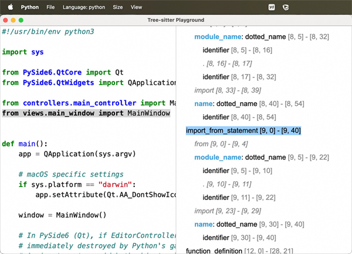

# tree-sitter-playground

[English](README.md) | [简体中文](README.zh-CN.md)

[tree-sitter](https://tree-sitter.github.io/tree-sitter/) 是一个常用的代码语法解析工具，支持非常多的开发语言，能够将代码解析为抽象语法树（AST）。在官方网站上提供了一个 [在线解析工具 playground](https://tree-sitter.github.io/tree-sitter/7-playground.html)，可以实时将代码转换为 AST。

但是官方的 playground 存在一些局限：
* 支持的语言种类有限，而 `tree-sitter` 命令自带的 playground 配置和运行复杂。
* 显示的 AST 值包含具名节点，对于匿名节点不显示。
* 代码和 AST 的关联展示是单向的，只能通过点击 AST 节点，定位到代码，反之不行。

## 功能

`tree-sitter-playground` 是使用 Python + Qt/PySide6 开发的桌面应用，提供更好的本地 tree-sitter 代码解析展示。

* 支持更多的语言。
* AST 除了显示具名节点，也能够显示匿名节点（以点开头的节点）。
* 代码和 AST 双向关联，点击代码同时加量 AST 节点，反之亦然。


## 截图

丰富的语言支持：


支持代码和AST的双向关联：




## 安装和运行

本软件用 Python 开发，可以运行在 python 3.6 或更高版本。

首先确保已安装了 Python。

1. 克隆项目仓库：

   ```bash
   git clone https://github.com/jiangxin/tree-sitter-playground.git
   cd tree-sitter-playground
   ```

2. 升级 pip。对于 python 3.7 等较低版本，如果pip 不升级，会导致无法找到匹配的 PySide6 安装包。

   ```bash
   python -m pip install -U pip
   ```

3. 安装 Python 依赖：

   对于 Python 3.9 或更高版本，执行：

   ```bash
   pip install -r requirements.txt
   ```

   对于 Python 3.6 ~ 3.8 版本，执行：

   ```bash
   pip install -r requirements/py36.txt
   ```

4. 运行 tree-sitter-playground：

   ```bash
   python tree-sitter-playground.py
   ```
